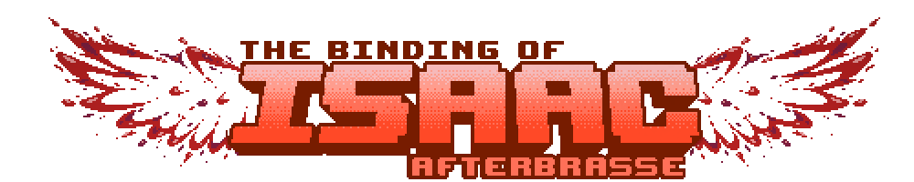

# 

# AfterBrasse
Mod Communautaire du jeu The Binding of Isaac : Afterbirth +

http://www.twitch.tv/shisheyu_mayamoto

https://steamcommunity.com/sharedfiles/filedetails/?id=864472370

# Membres de la team de Developpement

## Chef de projet

- Shisheyu

## Artistes

- Aktraizer
- Magikwhite
- Illuday
- Lucyna
- Mathbou
- AeroKansaki
- Asenith

## Développeurs

- Krayz
- Illuday
- Azqswx
- Sliost
- Dogeek
- Conan_Sempai
- Alch3my
- Sp4ceCore

## Animateurs

- Aktraiser
- Magikwhite
- Azqswx

## A titre honorifique

- Greninja_San - Sprite Green Cross
- xahos - Brave Shoe Code
- SlyHawks - Torn Gloves Code
- Nagachi - Zodiac Transformation Code
- Drazeb - Dad's Beer, Krampus' Tooth
- Botameuh - Toxic Hearts sprites

# TO DO

- Check in github's Issue system for progression from now on.

# Installation

- Download the git repository as a zip file
- Extract the downloaded zip on your computer
- Copy the "0stillbirth" folder into your binding of isaac afterbirth + mods folder

    - Windows : C:\\Users\\\<username>\\Documents\\My Games\\binding of isaac afterbirth + mods\\
    
    - Linux : ~/.local/share/binding of isaac afterbirth + mods/
    
    - Mac OS : ~/Library/Application Support/Binding of Isaac Afterbirth+ Mods

# Mise en place de git dans le dossier mods du jeu

## Windows

- Téléchargez et installez : http://msysgit.github.io
- Allez dans votre dossier de mods (cf au dessus)
- Créez un dossier vide appelé "0stillbirth" (si ce dossier existe déjà, supprimez le et recréez un dossier vide)
- Ouvrez ce dossier dans un terminal(Shift + clic droit, ouvrir une invite de commande ici)
- Tapez ces commandes (dans le dossier 0stillbirth):
    - git clone https://github.com/Shisheyu/AfterBrasse .

## Unix (MacOS & Linux)

- Allez dans votre dossier de mods (cf au dessus)
- Créez un dossier vide appelé "0stillbirth" (si ce dossier existe déjà, supprimez le et recréez un dossier vide)
- Ouvrez ce dossier dans un terminal(Clic droit : ouvrir un terminal)
- Tapez ces commandes (dans le dossier 0stillbirth):
    - git clone https://github.com/Shisheyu/AfterBrasse .

# Utiliser git

Tapez ces commandes dans l'ordre :

- git pull
- git add *
- git commit -m "Description du commit"
- git push
    - username
    - password

Git permet de récupérer des versions précédentes, grâce à son système de versionnage (commits)
- Allez dans commits
- cliquez sur < > en face du commit que vous souhaitez tester
- Téléchargez le commit avec le bouton "clone or download"
- copiez le code dans votre dossier de mods
- testez ! (attention à ne pas commit à partir de vieilles versions, git pull pour revenir à la dernière version uploadée)
